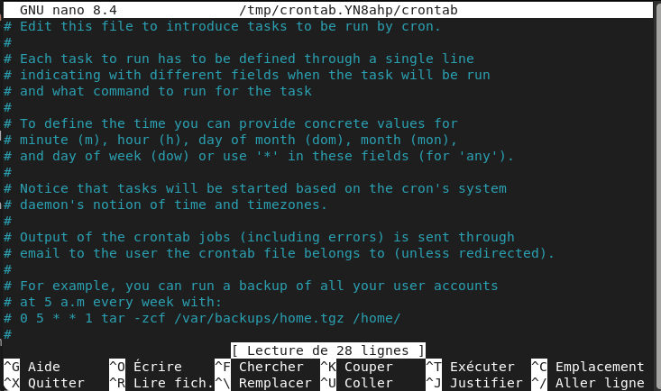
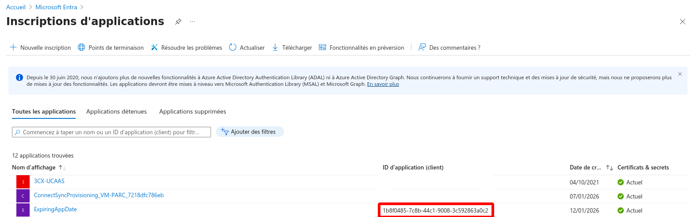
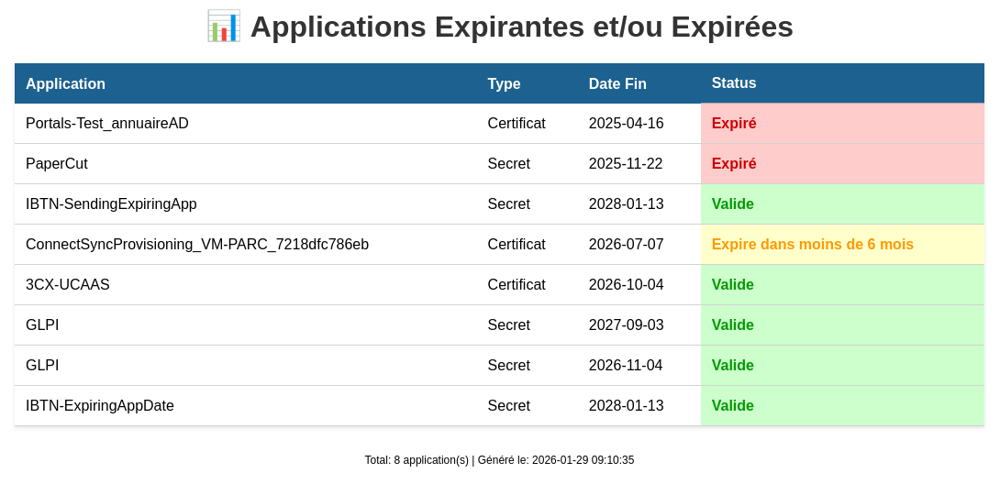
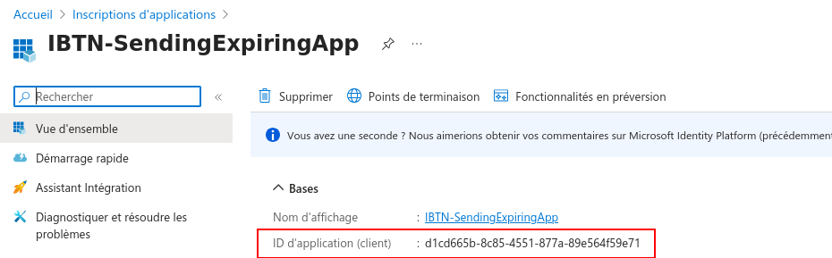
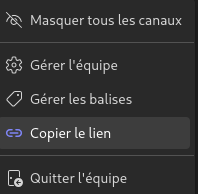
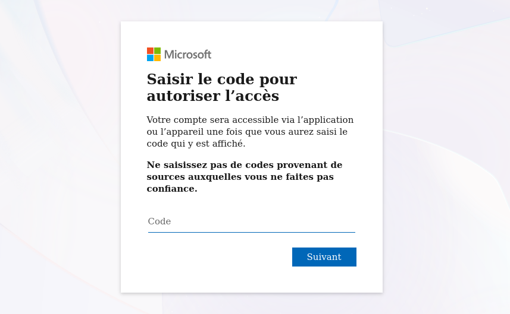
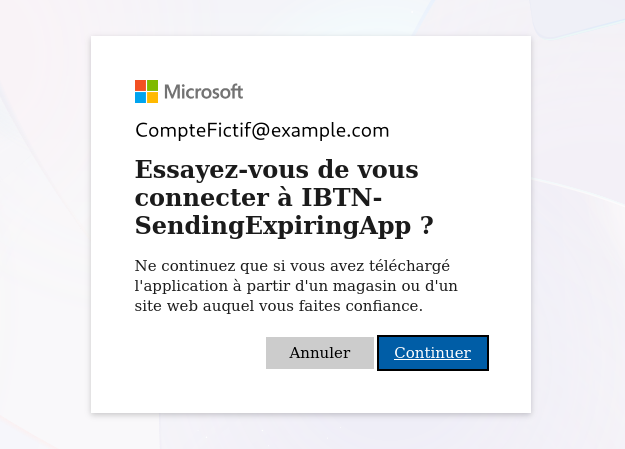
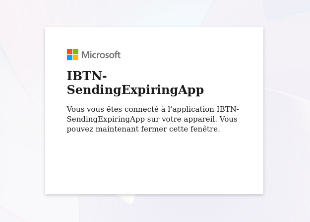

# Guide

## Préparation de l'environnement

NB : Les commandes suivantes sont à taper dans le terminal

Pour permettre une meilleure lecture de ce fichier : 
- Si vous souhaitez une application à télécharger : [Typora](https://typora.io/#feature)
	* Cliquez sur `Download` en haut de la page ;
	* Sélectionnez votre système d'exploitation ; 
	* Soit le téléchargement commence immédiatement (pour Windows notamment) ; 
	* Soit quelques consignes doivent être suivies (pour Linux par exemple) : 
		* Appuyez sur le bouton `Download Typora.deb` ; 
		* -- OU --
		* Tapez dans le terminal les commandes indiquées sur le site (aussi indiquées ci-dessous) : 
			```sh
			# Add Typora's key
			sudo mkdir -p /etc/apt/keyrings
			curl -fsSL https://downloads.typora.io/typora.gpg | sudo tee /etc/apt/keyrings/typora.gpg > /dev/null	
			# Add Typora's repository securely
			echo "deb [signed-by=/etc/apt/keyrings/typora.gpg] https://downloads.typora.io/linux ./" | sudo tee /etc/apt/sources.list.d/typora.list
			sudo apt update
			# Install typora
			sudo apt install typora
			```

- Si vous souhaitez rester sur une version en ligne : [StackEdit](https://stackedit.io/)
	* Cliquez sur `Start Writing` en haut de la page ;
	* Cliquez sur le logo de StackEdit en haut à droite de l'écran, un menu vertical s'ouvrira ; 
	* Dans ce menu vertical, sélectionnez `Import / Export` puis `Import Markdown` ; 
	* Allez chercher dans les fichiers de l'ordinateur le fichier MD à lire.
	* **Attention** : cette version en ligne ne permet pas de visionner les images mises à disposition dans ce markdown

1. Sur Debian
	- Avant tout, ne pas oublier de taper la commande : `sudo apt update && sudo apt upgrade` ; 
	- **PHP**, installable avec la commande : `sudo apt install php php-common libapache2-mod-php php-cli` ; 
	- **Python**, installable avec la commande : `sudo apt install python3 python3-pip python3-venv pip` ;
	- **Attention** il est nécessaire de créer un environnement virtuel Python pour l'installation des dépendances essentielles :
		* **Remarque** : Il faut s'assurer que l'on se trouve dans le répertoire de travail (ici ***appExpirees***) !
		* Création de l'environnement virtuel : `python3 -m venv .venv` ; 
		* Activation de l'environnement : `source .venv/bin/activate` ;
		* Puis installation des dépendances : `pip install -r requirements.txt`
			* Le `-r` est important car il permet de lire l'entièreté du fichier et d'installer toutes les dépendances nécessaires.
		* **Pour lancer le script :** `python expiringAppDate.py` ;
			* Vérifier que le terminal a une structure telle que l'exemple suivant avant de taper la commande : `(.venv) Utilisateur@Appareil:~Chemin/Vers/Le/Script`
		* Pour désactiver l'environnement virtuel (en général en fin d'utilisation) : `deactivate`.

&nbsp;

2. Sur Windows
	- **PHP**, installable en suivant le lien : 
		* Installez la dernière version de PHP via ce lien : [Télécharger PHP sur Windows](https://windows.php.net/download/)
			* **Attention** : Il faut vérifier que l'on télécharge la version **x64 Thread Safe**, ou si votre appareil vous le permet **x86 Thread Safe**.
		* Créez un dossier `php` à la racine de votre environnement de travail (`C:\`) puis extraire le contenu du ZIP précédemment enregistré dedans ;
		* Configurez PHP en créant le fichier `php.ini` (copie du fichier `php.ini-development`) comme configuration par défaut. Modifiez le fichier `php.ini` (enlevez le "**;**" pour décommenter la ligne). <br>
		Il faut également activer les extensions nécessaires à la majorité des applications : 
			```ini
			extension=curl 
			extension=gd 
			extension=mbstring 
			extension=pdo_mysql
			```
			* **Remarque** : Il est possible d'installer PHP n'importe où sur votre système, mais il faudra modifier les chemins référencés.
		* Ajoutez PHP à la variable d'environnement `PATH`. 
			* Cliquez sur le bouton `Démarrer` de Windows et tapez `environnement`, puis cliquez sur `Modifier les variables d’environnement système`.
			* Sélectionnez l'onglet `Avancé`, puis cliquez sur le bouton `Variables d'environnement`.
			* Faites défiler la liste des variables système et cliquez sur `Chemin d'accès`, puis sur le bouton `Modifier`.
			* Cliquez sur `Nouveau` et ajoutez `C:\php`.
		* **Apache ne doit pas être en cours d'exécution**, ouvrez le fichier CONF `C:\Apache24\conf\httpd.conf` avec un éditeur de texte. 
			* Ajoutez au bas du fichier pour définir PHP en tant que module Apache :
				```sh
				# PHP8 module
				PHPIniDir "C:/php"
				LoadModule php_module "C:/php/php8apache2_4.dll"
				AddType application/x-httpd-php .php
				```

	- **Python**, installable en suivant le lien : [Télécharger Python sur Windows](https://www.python.org/downloads/) :
		* Choisissez la version adaptée à Windows.
		* Téléchargez le fichier d'installation et exécutez-le.
		* Cochez la case "Ajouter Python à PATH" pour faciliter l'utilisation en ligne de commande.
		* Cliquez sur `Install Now`.

	- **Attention** il est nécessaire de créer un environnement virtuel Python pour l'installation des dépendances essentielles :
		* **Remarque** : Il faut s'assurer que l'on se trouve dans le répertoire de travail (ici ***appExpirees***) !
		* Création de l'environnement virtuel : `C:\Python35\python -m venv C:\Chemin\Vers\Le\.venv` ; 
		* Activation de l'environnement : `.venv\Scripts\activate` ;
		* Puis installation des dépendances : `pip install -r requirements.txt`
			* Le `-r` est important car il permet de lire l'entièreté du fichier et d'installer toutes les dépendances nécessaires.
		* **Pour lancer le script :** `C:\Chemin\Vers\Le\.venv\Scripts\python.exe expiringAppDate.py` ;
		* Pour désactiver l'environnement virtuel (en général en fin d'utilisation) : `deactivate`.

&nbsp;

3. Tout ceci est automatisé via une **configuration Cron** (sur Debian) : 
	- Pour accéder à Cron : `crontab -e` dans le terminal. Cette commande va amener l'utilisateur à une page comme celle-ci :

		&nbsp; 

	- Pour valider l'automatisation, il faut descendre jusqu'en bas de la page et taper une ligne dont la structure sera : 
		* Minute **(0-59)** | Heure **(0-23)** | Jour du mois **(1-31)** | Mois **(1-12)** | Jour de la semaine **(1-7 ou mon,tue,wed...)** | **Commande à exécuter**

		* Ce qui peut donner une ligne comme : `0 8 * * 1 /usr/bin/python3 /chemin/absolu/vers/un/script.py` 
		pour une planification tous les lundis à 8h du script.py concerné.

		* Il est aussi possible de faire un enchaînement de commandes entre elles avec des : **&&**. Ce qui pourrait donner : 
		`0 8 * * 1 sudo apt update && sudo apt upgrade -y`

		* Enfin, une dernière option permet de relancer le script à chaque redémarrage de la machine : **@reboot**. Cette option va venir remplacer toutes les valeurs concernant la date, pour donner une ligne du style suivant : 
		`@reboot sudo apt update && sudo apt upgrade -y`

		* Ce ne sont pas les seules options possibles avec crontab (*@daily, @weekly, @monthly, @yearly*), mais ce seront les plus importantes dans notre cas.

		* Mise en situation : l'une des lignes cron que l'on peut retrouver est `0 8 * * 1 cd /home/informatique/Bureau/appExpirees/ && .venv/bin/python expiringAppDate.py`.

&nbsp;

4. Ou **Planificateur de tâches** (sur Windows) :

	- Etape 1 : Accéder au Planificateur de tâches
		* Appuyez sur les touches `Windows + R` pour ouvrir la boîte de dialogue `Exécuter` (situé en bas à gauche de l'écran).
		* Tapez `taskschd.msc` et appuyez sur `Entrée`.
		* La fenêtre du Planificateur de tâches s’ouvrira en affichant les tâches déjà planifiées.

	- Etape 2 : Créer une nouvelle tâche
		* Création rapide avec une tâche de base :
			* Dans le volet de droite, cliquez sur `Créer une tâche de base` ;
			* Donnez un nom et une description à la tâche et cliquez sur `Suivant` ;
			* Sélectionnez la fréquence de déclenchement de la tâche (*quotidien, hebdomadaire, évènement spécifique, etc.*) ;
			* Définissez la date, l’heure et, le cas échéant, la fréquence de répétition de la tâche puis cliquez sur `Suivant` ;
			* Choisissez l’action à exécuter : `Lancer un programme` ;
			* Cliquez sur `Parcourir` et sélectionnez le programme ou le script à exécuter ;
			* Ajoutez des arguments si besoins ;
			* Cliquez sur `Terminer` pour valider.

&nbsp;

## Explication des différents scripts

### I. expiringAppDate.py

1. Import des modules nécessaires (lignes 1-5)
	- `requests` : Il s'agit d'un module qui permet de réaliser des **requêtes HTTP** en Python ;

	- `json` : Ce module standard permet de manipuler facilement des fichiers JSON, qu’il s’agisse de les lire, de les modifier, ou de les créer. 
		* Le JSON (JavaScript Object Notation) est un format de données très populaire utilisé pour représenter des informations de manière simple et lisible.

	- `datetime` & `timedelta` : ces 2 classes issues du module **datetime** de Python permettent de manipuler les dates et les heures. Ces 2 classes ont pour effet : 
		* **datetime** : Un objet datetime est un seul et même objet contenant toutes les informations d'un objet `date` et d'un objet `time`. Comme un objet date, il va utiliser le calendrier Grégorien actuel étendu vers le passé et le futur ; comme un objet time, il suppose qu'il y a exactement 3600*24 secondes chaque jour.

		* **timedelta** : Un objet timedelta représente une durée, c'est-à-dire la différence entre deux instances de datetime ou date.

	- `logging` : Ce module définit les fonctions et les classes qui mettent en œuvre un système flexible d’enregistrement des événements pour les applications et les bibliothèques.

	- `os` : Ce module fournit une façon portable d'utiliser les fonctionnalités dépendantes du système d'exploitation. Si l'on souhaite lire ou écrire un fichier avec `open()` ou encore manipuler les chemins de fichiers avec `os.path`.

2.  Les variables importantes (lignes 7-18)
	- `clientId` est l'ID de l'application qui permet au programme ***expiringAppDate.py*** d'accéder aux applications de Microsoft Entra (anciennement Azure AD). Cette ID est obtenable ici : 

		&nbsp; 

	- `clientSecret` : le secret n'apparaît en entier que lors de la création de l'application et permet, couplé au `clientId`, de lire les applications sur Microsoft Entra. Il sera visible ici : 

		&nbsp; 

	Remarque : Dans Microsoft Entra, ce programme est connu sous l'application **IBTN-ExpiringAppDate**

	- `tenantName` : Il s'agit du nom de domaine lié à Microsoft Entra, trouvable ici : 

		&nbsp; 

	- `months` : Cette variable correspond aux **nombres de mois maximum** pour commencer la liste des avertissements ;

	- `path` : Cette variable correspond au chemin du fichier JSON de sortie du programme ;

	- `loginUrl` : Il s'agit du lien qui permet au programme de se connecter à Entra ; 

	- `graphUrl` : Il s'agit du lien générique vers Microsoft Graph pour la lecture des applications ;

	- `appsUrl` : Il s'agit du lien complet permettant la lecture des applications ;

	- `jsons` : Cette liste va contenir toutes les données des applications répertoriées dans la catégorie `Inscription d'application` de Microsoft Entra.

3. Le programme (lignes 20-128)
	- **Système de logs** (lignes 20-29) : En cas d'erreur lors de l'exécution du programme, des logs seront enregistrés dans le dossier ***docImportant*** sous le nom `expiringCertificate.log` ; 

	- **Sytème de connexion** (lignes 31-57) : 
		* Afin de pouvoir lire les certificats et secrets, l'application a besoin de se connecter à Microsoft Graph à l'aide d'un token de connexion qui sera créé par la fonction `getAccessToken` qui va renvoyer le résultat d'une requête HTTP **(lignes 31-46)** ;

		* La variable `oauth` va appeler la fonction en y passant les paramètres demandés. Variable à partir de laquelle on va récupérer les valeurs `access_token` et `token_type` qui sont nécessaires pour lire les certificats et doivent se trouver dans l'entête de la requête HTTP **(lignes 48-57)**.
	
	- **Traitement de toutes les applications** (lignes 59-116) :
		* Tant que le lien est valide, on envoie une requête à Microsoft Graph pour stocker les informations de l'application obtenues dans la variable `applications` **(lignes 60-64)** ;

		* Pour chaque application, on récupère son intitulé et son ID **(lignes 67-70)** ; 

		* Pour chaque application, on va récupérer la valeur de `passwordCredentials` pour les secrets ou `keyCredentials` pour les certificats et la stocker dans la liste `items`. Pour chaque valeur de la liste, on récupère la date de début et la date de fin de chaques certificats et secrets. En cas d'absence de date de début et/ou de date de fin, on passe à la suite du programme **(lignes 72-78)** ; 

		* On va ensuite déterminer si l'application possède un secret ou un certificat **(lignes 80-84)** ; 

		* Afin qu'on puisse traiter les dates obtenues, on les formate. Puis, on définit la date jusqu'à laquelle on souhaite récupérer les informations d'expiration. (Optionnel) Enfin, on peut ajouter une date pour laquelle le renouvellement devient urgent **(lignes 86-90)** ; 

		* A l'aide des dates enregistrées un peu plus tôt, on va définir le statut de l'expiration **(lignes 92-105)** : 
			* La date de fin est inférieure à la date du jour : *Expiré* ; 
			* La date de fin est inférieure à la date maximale et à la date urgente : *Expire bientôt (moins d'un mois)* ; 
			* La date de fin est seulement inférieure à la date maximale : *Expire dans moins de 6 mois* ;
			* La date de fin est supérieure à la date maximale : *Valide*.
		
		* On va créer un dictionnaire `json_entry` qui va contenir les informations essentielles et qui va l'ajouter à la liste `jsons` **(lignes 107-117)** ;

		* Une fois le traitement de l'application terminé et qu'on a obtenu les informations qui nous intéressent, on passe à l'application suivante **(lignes 119-120)**.

	- **L'enregistrement des données** (lignes 122-128) : 
		* On ajoute dans le fichier de log des messages pour signaler le nombre d'applications traitées ainsi que le nombre d'applications classées dans chaque catégorie **(lignes 122-123)** ;

		* Si la liste de résultat existe, on va écrire dans le fichir JSON ***ExpiringApps.json*** son contenu **(lignes 125-128)**.

### II. webServer.py

1. Import des modules essentiels (lignes 1-4) : 
	- `Flask` & `Response` : Ces 2 classes appartenant au module `flask` de Python qui est un petit framework web léger et qui fournit des outils et des fonctionnalités utiles pour faciliter la création d’applications web en Python. 
		* **Flask** : Cet objet est le centre de gravité de l'application web ;
		* **Response** : Cet objet est utilisé par défaut par Flask, il est notamment utile pour l'utilisation de HTML.
	
	- `subprocess` : Il s'agit d'un outil qui permet d'exécuter d'autres programmes ou commandes à partir d'un code Python. Il peut être utilisé pour ouvrir de nouveaux programmes, leur envoyer des données et obtenir des résultats en retour.

	- `os` : Ce module fournit une façon portable d'utiliser les fonctionnalités dépendantes du système d'exploitation. Si l'on souhaite lire ou écrire un fichier avec `open()` ou encore manipuler les chemins de fichiers avec `os.path`.

	- `logging` : Ce module définit les fonctions et les classes qui mettent en œuvre un système flexible d’enregistrement des événements pour les applications et les bibliothèques.

2. Création de l'application web (lignes 6-8) : On initialise un objet Flask qui va prendre pour intitulé le nom du fichier et on récupère le chemin qui mène aux scripts.

3. Système de logs (lignes 10-19) : En cas d'erreur lors de l'exécution du programme, des logs seront enregistrés dans le dossier ***docImportant*** sous le nom `expiringCertificate.log` ; 

4. Récupération des données de l'affichage (lignes 21-50) : 
	- On va essayer d'exécuter le fichier ***dataFormatage.php*** et récupérer le résultat dans la variable `result` **(lignes 21-32)** ; 

	- Si l'exécution du PHP retourne un code 0 (succès) alors on affiche le résultat de l'exécution. Sinon, on renvoie un message d'erreur sur l'application web **(lignes 34-38)** ; 

	- On ajoute plusieurs exceptions pour pouvoir régler au plus rapidement possible les erreurs **(lignes 40-48)** : 
		* `subprocess.TimeoutExpired` : Si l'exécution du script PHP prend au moins 10 secondes, on renvoie une erreur et on ajoute un message d'erreur dans le fichier de log ; 
		* `FileNotFoundError` : Si le fichier PHP est introuvable (effacé par erreur ou stocké dans un autre répertoire par exemple), on renvoie une erreur différente et on ajoute un message d'erreur dans le fichier de log ; 
		* `Exception` : S'il y a une autre erreur (non définie précédemment), on renvoie un message d'erreur générique et on ajoute un message d'erreur dans le fichier de log.

	- On lance l'application web sur l'adresse de la machine (ici 192.168.50.247) et au port 5000 (ce qui correspond à un lancement en localhost port 5000) **(lignes 50-51)**.

5. Voir le résultat : Afin de voir le résultat de l'exécution de ce script il faut se rendre dans son navigateur et taper dans la barre de recherche `https://ibtn-pcf-069.ibtn.local:5000/` ou `https://192.168.50.247:5000/`. Cependant, une page d'avertissement apparaîtra sur l'écran, il faudra cliquer sur le bouton "Avancer" puis sur "Accepter le risque". Une fois cela fait, la page suivante devrait s'afficher à l'écran : 

	&nbsp; 

### III. sendingExpiringData.py

1. Import des modules nécessaires (lignes 1-8)
	- `json` : Ce module standard permet de manipuler facilement des fichiers JSON, qu’il s’agisse de les lire, de les modifier, ou de les créer.

	- `os` : Ce module fournit une façon portable d'utiliser les fonctionnalités dépendantes du système d'exploitation. Si l'on souhaite lire ou écrire un fichier avec `open()` ou encore manipuler les chemins de fichiers avec `os.path`.

	- `logging` : Ce module définit les fonctions et les classes qui mettent en œuvre un système flexible d’enregistrement des événements pour les applications et les bibliothèques.

	- `requests` : Il s'agit d'un module qui permet de réaliser des **requêtes HTTP** en Python.

	- `msal` : La Microsoft Authentication Library (MSAL) est un module Python qui permet à une application d'accéder au Cloud Microsoft en utilisant l'authentification des utilisateurs via leurs comptes Azure AD et/ou comptes Microsoft.

	- `webbrowser` : Il s'agit d'un module qui offre à l'utilisateur la possibilité d'afficher des documents basés sur du langage web (HTML et PHP notamment).

	- `pyperclip` : Ce module permet de copier et/ou coller du contenu dans le presse-papier. 
		* **Remarque :** le module pyperclip nécessite l'installation du paquet xclip sur Debian. Il faut entrer dans le terminal : `sudo apt install xclip`.

2. Les variables importantes (lignes 10 à 20)
	- `scriptDir` & `logFile` permettent de récupérer le chemin du fichier et de créer le fichier de log ***expiringCertificate.log*** dans le répertoire ***docImportant***.

	- `tenantId` : Il s'agit du nom de domaine lié à Microsoft Entra, trouvable ici : 
	
		&nbsp; 

	- `clientId` : Il s'agit de l'ID de l'application qui permet au programme sendingExpiringData.py d'accéder aux applications de Microsoft 365. Cette ID est obtenable ici :

		&nbsp; 

	- `teamId` : Il s'agit de l'ID de l'équipe de Microsoft Teams. Il est obtenable ici en faisant un clique droit sur le groupe concerné et en sélectionnant l'option *Copier le lien* : 

		&nbsp; 
		
		Puis, après avoir collé le lien il faut récupérer la partie suivante : 
		* https:// teams.microsoft.com /l/ channel/ **ID du Channel** /Nom?groupId= **ID de l'Equipe** &tenantId= **ID du Tenant**

	- `channelId` : L'ID du channel peut être récupéré de la même manière de l'ID de l'équipe dont la procédure de récupération est expliquée ci-dessus.

	- `cacheFile` : Il s'agit du chemin permettant d'accéder au fichier qui va contenir le token de connexion en cache.

	- `scopes` : Cette liste contient les autorisations dont le programme (enregistré en tant qu'application d'entreprise) a besoin pour envoyer un message dans un channel Teams.

3. Le programme (lignes 22-136)
	- **Système de logs** (lignes 22-27) : En cas d'erreur lors de l'exécution du programme ou lorsqu'une connexion est réussie, des logs seront enregistrés dans le dossier ***docImportant*** sous le nom `expiringCertificate.log` ; 

	- **Formatage du message** (lignes 29-46) : 
		* Les données contenues dans le fichier ***ExpiringApps.json*** sont chargées dans la variable (liste) `items` et on crée un message, vide par défaut **(lignes 29-32)**.

		* S'il n'y a aucune donnée à exploiter (aucun certificats/secrets expirés), on modifie le message en conséquence : *Aucun secrets ou certificats n'ont expiré* **(lignes 33-34)**.

		* S'il y a des données à exploiter, on ajoute au message un en-tête et les informations souhaitées de chaque application (intitulé, id, certificats/secrets, date de fin de validité et le statut d'expiration) à condition que son statut correponde à la valeur *Expiré* **(lignes 35-46)**

	- **Classe de l'authentification via MSAL (Microsoft Authentication Library)** (lignes 48-86) : 
		* Création et initialisation de la classe qui va gérer l'authentification. Lors de la création d'une instance l'utilisateur doit renseigné : une application MSAL, les autorisations dont l'application a besoin et le fichier cache qui va contenir le token de connexion **(lignes 48-53)**.

		* On va essayer de récupérer le token de connexion stocké dans le cache à condition qu'il soit valide, s'il a changé (modifié ou réécrit par exemple) ou s'il a expiré, on modifie le fichier cache pour enregistrer le nouveau token **(lignes 55-64)**.

		* Si aucun token n'est stocké en cache, on envoie un message contenant un code à l'utilisateur. Pour faciliter la procédure de reconnexion, on coupe le message généré pour ne garder que le code de connexion (***message.replace()***), on copie le code dans le presse-papier (***pyperclip.copy()***), on ouvre le navigateur sur la page web pour se login (***webbrowser.open()***) et on ajoute une phrase dans le fichier de log qui indique qu'un code a été généré **(lignes 66-75)**. 
			* L'utilisateur devra se rendre sur son navigateur pour coller le code obtenu. L'interface de connexion devrait ressembler à la suite d'images suivante : 

			&nbsp; 

			&nbsp; 

			&nbsp; 

			&nbsp; 

		* Une fois l'utilisateur connecté, on stocke momentanément le nouveau token dans une variable puis on met à jour le fichier cache avec le nouveau token récupéré. Si la connexion échoue, on envoie un log **(lignes 77-86)**.

	- **Récupération du token stocké** (lignes 88-92) : On va stocker dans une variable `cache` le token sérialisé puis on va le désérialiser pour obtenir l'ensemble du token.
		* **NB :** La sérialisation est le codage d'une information sous la forme d'une information plus petite pour, par exemple, sa sauvegarde ou son transport sur le réseau.

	- **Initialisation de l'application MSAL** (lignes 94-99) : On va créer un objet `PublicClientApplication` avec lequel on va lier notre programme à Microsoft Graph. Puis, on va chercher le token pour se connecter à Graph.

	- **Envoi du message sur le canal Teams** (lignes 101-136) : 
		* On va définir et/ou récupérer les variables importantes pour l'envoi du message : le token d'authentification, l'en-tête d'appel de Graph, l'url exact du canal Teams et le message formaté en HTML pour un meilleur affichage **(lignes 107-124)**.

		* On va envoyer une requête POST sur l'url du canal Teams avec le message que l'on souhaite envoyer **(lignes 126-127)**.

		* On va vérifier si l'envoi s'est correctement déroulé ou non et envoyer un log adapté à l'état de l'envoi **(lignes 129-133)**.

		* Enfin, on exécute la fonction d'envoi **(lignes 135-136)**.

### IV. docImportant

#### A. certificat.pem & clePrivee.pem

1. Ces 2 fichiers permettent aux applications Flask d'être sécurisées via un certificat. Ils sont obtenables en tapant la commande suivante : `openssl req -new -newkey rsa:4096 -nodes -keyout clePrivee.pem -out certificat.csr -config certification.conf`. Il sera ensuite nécessaire d'envoyer le fichier `certificat.csr` à une **autorité de certification** tout en gardant à l'abri des regards le fichier `clePrivee.pem`. Le fichier `certification.conf` doit avoir la structure suivante pour que la commande fournisse un fichier CSR convenable : 

	&nbsp; ![
		Ce fichier doit avoir une structure similaire à celle-ci : 
		[ req ]
		default_bits       = 4096
		distinguished_name = dn
		req_extensions     = v3_req
		prompt             = no
		default_md         = sha256
		[ dn ]
		CN = IBTN-PCF-069.ibtn.local
		[ v3_req ]
		keyUsage = keyEncipherment, dataEncipherment
		subjectAltName = @alt_names
		extendedKeyUsage = serverAuth
		[ alt_names ]
		DNS.1 = IBTN-PCF-069
		DNS.2 = IBTN-PCF-069.ibtn.local
		IP.1  = 192.168.50.247
	](images/fichierConf.png)

#### B. ExpiringApps.json

1. Ce fichier JSON va contenir toutes les informations essentielles des applications dont les certificats ou secrets ont expiré. 

#### C. expiringCertificate.log

1. Ce fichier log va contenir toutes les sorties générées par les scripts ***expiringAppDate.py***, ***webServer.py*** et ***sendingExpiringData.py***.

### V. dataFormatage.php

1. En-tête de la page Web (lignes 1-80) : Cette partie va notamment contenir le CSS (style de la page) ; 

2. Mise en forme des données sous forme de tableau (lignes 82-123) : Cette partie va récupérer les données du fichier ***ExpiringApps.json*** et les mettre en forme dans un tableau permettant une meilleur lisibilité des informations des applications. 

### VI. requirements.txt

1. Ce fichier contient toutes les dépendances python dont les programmes (.py) ont besoin afin d'être correctement exécutés.