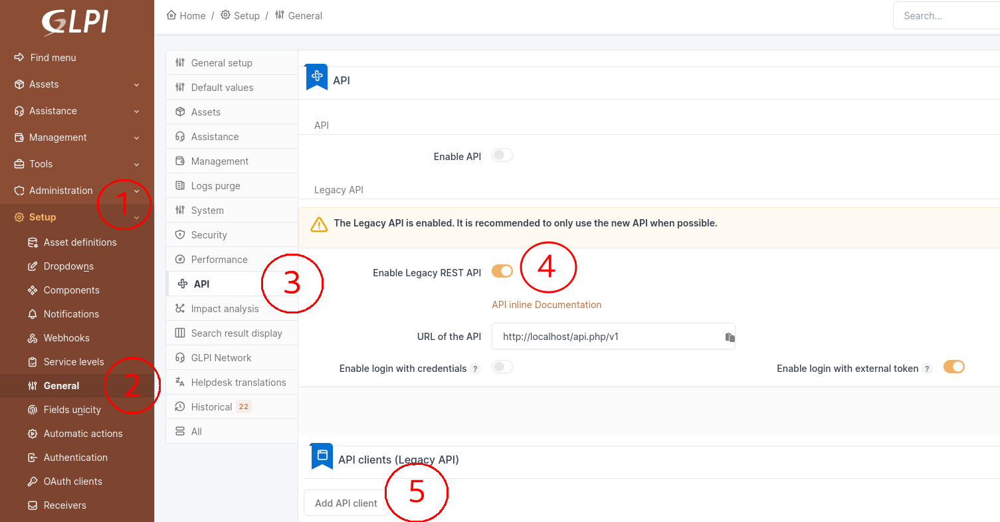
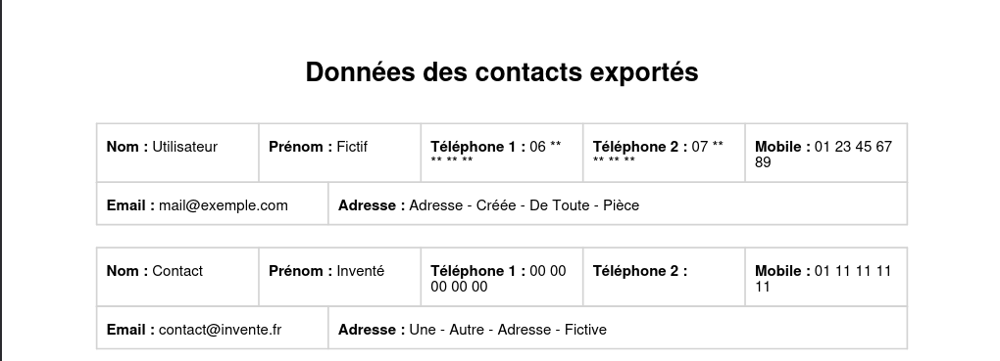
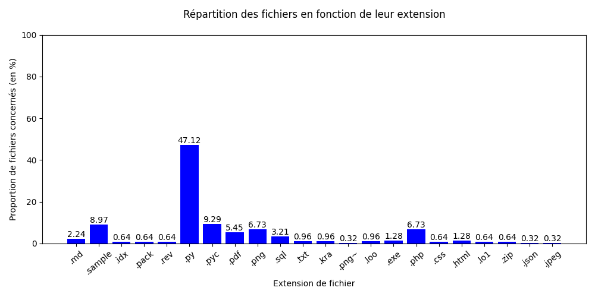

# Guide

## Préparation de l'environnement

NB : Les commandes suivantes sont à taper dans le terminal

Pour permettre une meilleure lecture de ce fichier : 
- Si vous souhaitez une application à télécharger : [Typora](https://typora.io/#feature)
	* Cliquez sur `Download` en haut de la page ;
	* Sélectionnez votre système d'exploitation ; 
	* Soit le téléchargement commence immédiatement (pour Windows notamment) ; 
	* Soit quelques consignes doivent être suivies (pour Linux par exemple) : 
		* Appuyez sur le bouton `Download Typora.deb` ; 
		* -- OU --
		* Tapez dans le terminal les commandes indiquées sur le site (aussi écrites ci-dessous) : 
			```sh
			# Add Typora's key
			sudo mkdir -p /etc/apt/keyrings
			curl -fsSL https://downloads.typora.io/typora.gpg | sudo tee /etc/apt/keyrings/typora.gpg > /dev/null	
			# Add Typora's repository securely
			echo "deb [signed-by=/etc/apt/keyrings/typora.gpg] https://downloads.typora.io/linux ./" | sudo tee /etc/apt/sources.list.d/typora.list
			sudo apt update
			# Install typora
			sudo apt install typora
			```

- Si vous souhaitez rester sur une version en ligne : [StackEdit](https://stackedit.io/)
	* Cliquez sur `Start Writing` en haut de la page ;
	* Cliquez sur le logo de StackEdit en haut à droite de l'écran, un menu vertical s'ouvrira ; 
	* Dans ce menu vertical, sélectionnez `Import / Export` puis `Import Markdown` ; 
	* Allez chercher dans les fichiers de l'ordinateur le fichier MD à lire.
	* **Attention** : cette version en ligne ne permet pas de visionner les images mises à disposition dans ce markdown

1. Sur Debian
	- Avant tout, ne pas oublier de taper la commande : `sudo apt update && sudo apt upgrade` ; 
	- **Python**, installable avec la commande : `sudo apt install python3 python3-pip python3-venv pip` ;
	- **Attention** il est nécessaire de créer un environnement virtuel Python pour l'installation des dépendances essentielles :
		* **Remarque** : Il faut s'assurer que l'on se trouve dans le répertoire de travail (ici ***recupData***) !
		* Création de l'environnement virtuel : `python3 -m venv .venv` ; 
		* Activation de l'environnement : `source .venv/bin/activate` ;
		* Puis installation des dépendances : `pip install -r requirements.txt`
			* Le `-r` est important car il permet de lire l'entièreté du fichier et d'installer toutes les dépendances nécessaires.
		* **Pour lancer le script :** `python apiGlpi.py` ;
			* Vérifier que le terminal a la structure suivante avant de taper la commande : `(.venv) Utilisateur@Appareil:~Chemin/Vers/Le/Script`
		* Pour désactiver l'environnement virtuel (en général en fin d'utilisation) : `deactivate`.

&nbsp;

2. Sur Windows
	- **Python**, installable en suivant le lien : [Télécharger Python sur Windows](https://www.python.org/downloads/) :
		* Choisissez la version adaptée à Windows.
		* Téléchargez le fichier d'installation et exécutez-le.
		* Cochez la case "Ajouter Python à PATH" pour faciliter l'utilisation en ligne de commande.
		* Cliquez sur "Install Now".

	- **Attention** il est nécessaire de créer un environnement virtuel Python pour l'installation des dépendances essentielles :
		* **Remarque** : Il faut s'assurer que l'on se trouve dans le répertoire de travail (ici ***recupData***) !
		* Création de l'environnement virtuel : `C:\Python35\python -m venv C:\Chemin\Vers\Le\.venv` ; 
		* Activation de l'environnement : `.venv\Scripts\activate` ;
		* Puis installation des dépendances : `pip install -r requirements.txt`
			* Le `-r` est important car il permet de lire l'entièreté du fichier et d'installer toutes les dépendances nécessaires.
		* **Pour lancer le script :** `C:\Chemin\Vers\Le\.venv\Scripts\python.exe apiGlpi.py` ;
		* Pour désactiver l'environnement virtuel (en général en fin d'utilisation) : `deactivate`.

## Explication des différents fichiers

### I. apiGlpi.py

1. Import des modules nécessaires (lignes 1-11)
	- `json` : Ce module standard permet de manipuler facilement des fichiers JSON, qu’il s’agisse de les lire, de les modifier, ou de les créer. 
		* Le JSON (JavaScript Object Notation) est un format de données très populaire utilisé pour représenter des informations de manière simple et lisible.

	- `glpi_api` : Ce module python permet les interactions entre un script python et GLPI. Il englobe les points d'accès de GLPI et gère les codes HTTP reçus. 

	- `logging` : Ce module définit les fonctions et les classes qui mettent en œuvre un système flexible d’enregistrement des événements pour les applications et les bibliothèques.

	- `os` : Ce module fournit une façon portable d'utiliser les fonctionnalités dépendantes du système d'exploitation. Si l'on souhaite lire ou écrire un fichier avec `open()` ou encore manipuler les chemins de fichiers avec `os.path`.

	- `requests` : Il s'agit d'un module qui permet de réaliser des **requêtes HTTP** en Python ;

	- `reportlab` : Il s'agit d'un module permettant de générer des fichiers pdf et/ou des graphiques grâce à un script. 
		* Pour éviter l'importation de ce module dans sa totalité (ce qui peut être conséquent), on se focalise uniquement sur les classes qui nous intéressent.
		* Mais il est possible de remplacer les lignes 6 à 11 par la simple ligne : `import reportlab`.

2. Les variables importantes (lignes 13-15) : 
	- `url` : Il s'agit de l'url exacte qui dirige l'utilisateur vers l'API de GLPI. Pour l'obtenir, il faut suivre les étapes suivantes : 
	
		&nbsp; 

	- `apiToken` : Pour obtenir ce token, il faut réaliser la suite de tâches suivante : 

		&nbsp; 

		* Après avoir cliqué sur "Ajouter une API", la page suivante (ou similaire) devrait apparaître à l'écran : 

		&nbsp; 

		* Après avoir de nouveau cliquer sur "Ajouter", la page suivante devrait apparaître : 

		&nbsp; 

		* **Remarque** : Si on laisse l'option "Régénérer" cochée, cela va avoir pour effet de générer un nouveau token pour l'API que l'on vient de créer, invalidant ainsi celui que l'on vient de copier à l'instant ! 

	- `userToken` : Ce token est obtenable après la réalisation des tâches suivantes : 

		&nbsp; 

		* **Remarque** : L'utilisateur concerné doit avoir des privilèges élevés (très élevés) afin de pouvoir accéder aux informations souhaitées ! 

		&nbsp; 

		* Une fois le bouton "Sauvegarder" cliqué, la page devrait se recharger, seule la partie suivante devrait avoir été modifiée : 

		&nbsp; 

		* **Remarque** : Si on laisse l'option "Régénérer" cochée, cela va avoir pour effet de générer un nouveau token pour l'utilisateur que l'on vient de créer, invalidant ainsi celui que l'on vient de copier à l'instant ! 

3. Le programme (lignes 17-156)
	- **Système de logs** (lignes 17-25) : Les logs du programme seront enregistrés dans le dossier ***docImportant*** sous le nom `exportData.log` ; 

	- **Fonction de téléchargement des documents** (lignes 28-44) : 
		* Cette fonction contient un docstring afin d'expliquer l'objectif de son exécution ainsi que les différents paramètres nécessaires à son exécution **(lignes 28-33)** ;

		* On initie 2 variables : l'une va vérifier si la limite que l'on a prédéfini a été atteinte et l'autre correspond au nombre d'itération (et donc aux IDs des documents à télécharger) **(lignes 35)**;

		* Tant que `reachLimit` n'a pas la même valeur que `numberIdJumped`, on essaie de télécharger le document ayant un ID égal à la valeur de `iteration`, si on réussit le téléchargement : on réinitialise la variable `reachLimit` et on incrémente la variable `iteration` pour passer au prochain document **(lignes 35-40)**.
			* **Remarque** : La valeur contenue dans la variable `numberIdJumped` peut être modifiée au désir l'utilisateur (surtout si la différence entre l'ID d'un document et le document le suivant directement est supérieur à `10` (valeur configurée par défaut)).

		* En cas d'erreur dans l'exécution du téléchargement (car aucun document ne peut être téléchargé) : on incrémente `reachLimit` pour arriver à la fin de l'exécution du programme à un moment et on incrémente également `iteration` pour passer à l'ID de document suivant. Enfin, on ajoute au log un message indiquant la fin du téléchargement **(lignes 41-44)**.

	- **Fonction d'export de la liste des contacts** (lignes 47-75) : 
		* Cette fonction contient un docstring afin d'expliquer l'objectif de son exécution ainsi que les différents paramètres nécessaires à son exécution **(lignes 47-52)** ;

		* On cherche à obtenir un token de connexion pour se connecter à l'API de GLPI **(lignes 54-60)** ; 

		* Si la connexion est un succès, on crée une session et on exporte les contacts au format JSON dans le fichier ***ExportContacts.json***. Puis on ajoute aux logs un message indiquant le succès de l'export. En cas d'erreur lors de la tentative de connexion, on ajoute aux logs un message d'erreur le spécifiant **(lignes 62-75)**.

	- **Fonction de téléchargement des contacts** (lignes 78-140) : 
		* Cette fonction contient un docstring afin d'expliquer l'objectif de son exécution ainsi que les différents paramètres nécessaires à son exécution **(lignes 78-82)** ;

		* On récupère les données contenues dans le fichier ***ExportContacts.json***. On crée un document PDF vierge. On initie une liste vide (`contactData`) pour ajouter les éléments du PDF **(lignes 84-91)** ; 

		* On crée un en-tête simple pour le document PDF et on l'ajoute à la liste des éléments **(lignes 93-97)** ; 

		* On définit le style du tableau avec les informations des contacts tel que la couleur des bordures ou du texte, la taille des caractères ou encore les alignements **(lignes 99-111)** ;

		* On va traiter les contacts un à un : 
			* On crée un premier tableau qui va contenir des informations (nom, prénom, téléphone) qui seront stockées dans de petites cellules. On ajoute ce tableau aux éléments du PDF **(lignes 115-125)**
			* On crée un deuxième tableau avec d'autres informations (mail, adresse). On ajoute également ce tableau aux éléments du PDF **(lignes 127-136)**

		* On va construire le PDF final dont le contenu est stocké dans la liste `contactData` et on ajoute aux logs un message indiquant la fin du téléchargement **(lignes 138-140)**

		* Exemple de résultat du PDF sortant : 

			&nbsp; 

	- **Lancement du script** (lignes 143-148) : On va initier la connexion à l'API de GLPI et ajouter un message au log en cas de réussite. Puis, on va exécuter les 3 fonctions définies ci-dessus pour récupérer les données et documents souhaités ; 

	- **Gestion des erreurs** (lignes 150-154) : En cas d'erreur de connexion à l'API de GLPI lors du lancement, on ajoute au fichier de log une erreur spécifique. Pour toutes les autres erreurs, on ajoutera aux logs une phrase d'erreur générique avec l'intitulé de l'erreur. 

### II. graphExport.py

1. Import des modules nécessaires (lignes 1-4)
	- `matplotlib.pyplot` : Cette bibliothèque permet de générer des graphiques depuis Python ; 

	- `os` : Ce module fournit une façon portable d'utiliser les fonctionnalités dépendantes du système d'exploitation. Si l'on souhaite lire ou écrire un fichier avec `open()` ou encore manipuler les chemins de fichiers avec `os.path` ;

	- `logging` : Ce module définit les fonctions et les classes qui mettent en œuvre un système flexible d’enregistrement des événements pour les applications et les bibliothèques.

	- `pylab` : Cette librairie permet d’utiliser de manière aisée les bibliothèques numpy (manipulation de valeurs mathématiques) et matplotlib (création de graphique) pour de la programmation scientifique avec Python.

2. Les variables importantes (lignes 6-7)
	- `path` : Il s'agit du chemin menant au répertoire dans lequel sont stockés les documents exportés ; 

	- `dictExt` : Ce dictionnaire va contenir toutes les extensions de fichier que le programme trouvera dans le dossier d'export (`path`) ainsi que le nombre de fois où elles reviennent.

3. Le programme (lignes 9-89)
	- **Système de logs** (lignes 9-17) : Les logs du programme seront enregistrés dans le dossier `docImportant` sous le nom `exportData.log` ;

	- **Fonction de comptage des extensions** (lignes 19-50) : 
		* Cette fonction contient un docstring afin d'expliquer l'objectif de son exécution ainsi que les différents paramètres nécessaires à son exécution **(lignes 20-24)** ;

		* Cette fonction va récupérer le contenu du répertoire donné dans le paramètre `directory` et créer 2 listes `subDir` et `subFile`. Ces deux listes vont contenir les sous-répertoires (`subDir`) et les fichiers contenus dans les dossiers (`subFile`) **(lignes 25-29)** ; 

		* Pour chaque élément présent dans le répertoire `directory` **(lignes 31-35)** : 
			* S'il s'agit d'un dossier : on ajoute l'élément à la liste `subDir` ;
			* Sinon, il s'agit d'un fichier : on l'ajoute alors à la liste `subFile` ;

		* Pour chaque fichier se trouvant dans la liste `subFile` **(lignes 37-45)** :
			* On récupère l'extension du fichier dans la variable `extension` ; 
			* S'il n'y a aucune extension : on passe à l'extension suivante ; 
			* Si l'extension se trouve déjà dans le dictionnaire : on incrémente son occurrence de 1 ; 
			* Sinon, l'extension ne se trouve pas dans le dictionnaire : on ajoute cette extension au dictionnaire et on incrémente valeur de 1 ; 

		* Appel récursif de la fonction **(lignes 47-50)** : 
			* Si cela est nécessaire, la fonction s'appelle elle-même pour parcourir les sous-répertoires ; 
			* Si le nombre de répertoire maximum à parcourir (`levelMax`) est égal à 0 <br>
			-- OU -- <br>
			Si le niveau du sous-répertoire actuel (`levelDep`) est plus petit que le nombre de dossier à parcourir au maximum (`levelMax`) ;
			* Pour chaque dossier dans la liste de sous-répertoires : on appelle la fonction de nouveau en modifiant le chemin pour partir du sous-répertoire et en incrémentant le niveau du répertoire de 1.

	- **Fonction de création de graphique** (lignes 53-81) :
		* Cette fonction contient un docstring afin d'expliquer l'objectif de son exécution ainsi que les différents paramètres nécessaires à son exécution **(lignes 54-56)** ;

		* On va convertir les données contenues dans le dictionnaire en pourcentage pour faciliter la lecture du graphique **(lignes 57-60)** ;

		* On va créer un graphique vide puis **(lignes 62-72)**: <br>
		On va définir le style et le contenu des axes du graphique ; <br>
		On va définir les titres du graphique, des axes ainsi que les limites de l'axe y (la hauteur) ; <br>
		On va afficher les valeurs de chaque barre pour une meilleure visualisation ; <br>
		Enfin, on définit la taille de l'image. 

		* On va créer autant de barres qu'il y a d'extension dans le dictionnaire `dictExt` avec une petite mise en forme **(lignes 74-76)** ; 

		* Enfin, on ajuste la taille de la fenêtre pour éviter le troncage du graphique et on l'enregistre dans le dossier ***docImportant*** sous le nom `fileProportion.png` **(lignes 78-81)**.

	- **Lancement du programme** (lignes 83-87) : On appelle les deux fonctions définies ci-dessus et on ajoute après un message dans le fichier de log pour indiquer la bonne exécution du programme.

	- **Gestion des erreurs** (lignes 88-89) : En cas d'erreur lors de l'exécution du programme, on ajoute un message dans le fichier de log avec l'erreur correspondante.

4. Le résultat de l'exécution de ce script devrait pouvoir donner un graphique comme celui-ci : 

&nbsp; 

### III. requirements.txt

1. Ce fichier contient toutes les dépendances python dont le programme (.py) a besoin afin d'être correctement exécuté.

### IV. docImportant

#### A. exportData.log

1. Ce fichier log va contenir les informations importantes générées par le script ***apiGlpi.py***.

#### B. documentPDF

1. Ce dossier va contenir tous les documents et le PDF des contacts exportés de GLPI.

#### C. ExportContacts.json

1. Ce fichier JSON va contenir toutes les informations des contacts répertoriés dans GLPI. 