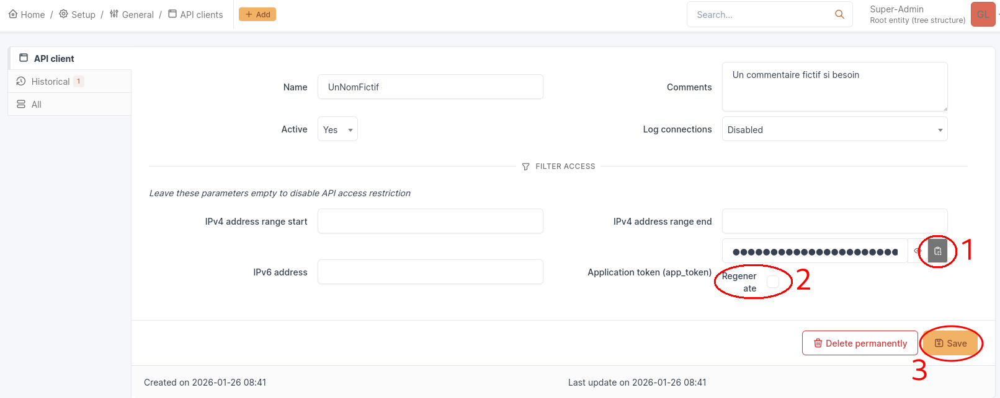
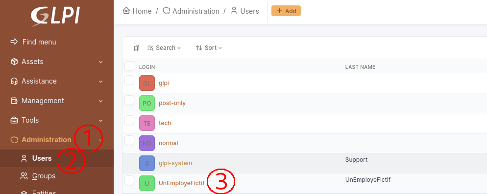
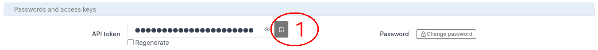
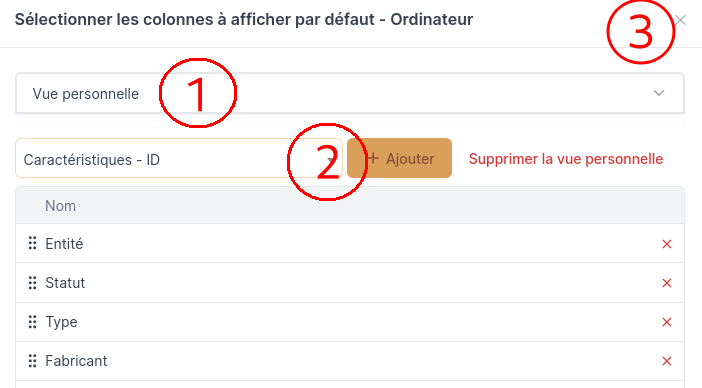
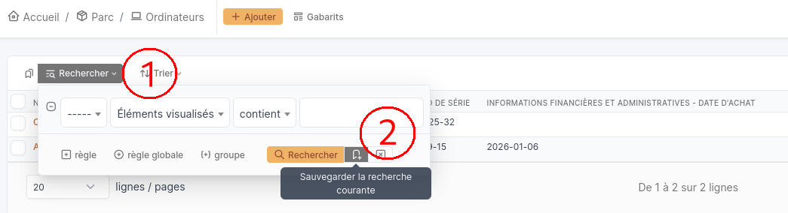
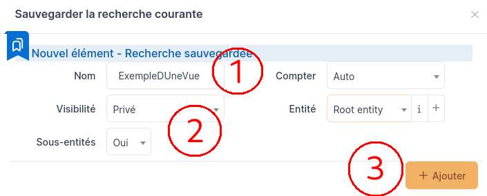
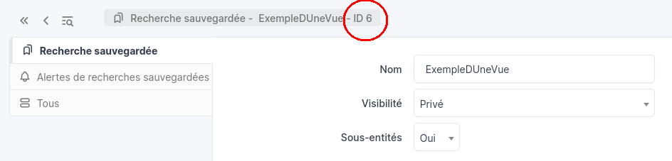

# Guide

## Préparation de l'environnement

NB : Les commandes suivantes sont à taper dans le terminal

Pour permettre une meilleure lecture de ce fichier : 
- Si vous souhaitez une application à télécharger : [Typora](https://typora.io/#feature)
	* Cliquez sur `Download` en haut de la page ;
	* Sélectionnez votre système d'exploitation ; 
	* Soit le téléchargement commence immédiatement (pour Windows notamment) ; 
	* Soit quelques consignes doivent être suivies (pour Linux par exemple) : 
		* Appuyez sur le bouton `Download Typora.deb` ; 
		* -- OU --
		* Tapez dans le terminal les commandes indiquées sur le site (aussi écrites ci-dessous) : 
			```sh
			# Add Typora's key
			sudo mkdir -p /etc/apt/keyrings
			curl -fsSL https://downloads.typora.io/typora.gpg | sudo tee /etc/apt/keyrings/typora.gpg > /dev/null	
			# Add Typora's repository securely
			echo "deb [signed-by=/etc/apt/keyrings/typora.gpg] https://downloads.typora.io/linux ./" | sudo tee /etc/apt/sources.list.d/typora.list
			sudo apt update
			# Install typora
			sudo apt install typora
			```

- Si vous souhaitez rester sur une version en ligne : [StackEdit](https://stackedit.io/)
	* Cliquez sur `Start Writing` en haut de la page ;
	* Cliquez sur le logo de StackEdit en haut à droite de l'écran, un menu vertical s'ouvrira ; 
	* Dans ce menu vertical, sélectionnez `Import / Export` puis `Import Markdown` ; 
	* Allez chercher dans les fichiers de l'ordinateur le fichier MD à lire.
	* **Attention** : cette version en ligne ne permet pas de visionner les images mises à disposition dans ce markdown

1. Sur Debian
	- **Python**, installable avec la commande : `sudo apt install python3 python3-pip python3-venv pip` ;
	- **Attention** il est nécessaire de créer un environnement virtuel Python pour l'installation des dépendances essentielles :
		* **Remarque** : Il faut s'assurer que l'on se trouve dans le répertoire de travail (ici ***infoMateriel***) !
		* Création de l'environnement virtuel : `python3 -m venv .venv` ; 
		* Activation de l'environnement : `source .venv/bin/activate` ;
		* Puis installation des dépendances : `pip install -r requirements.txt`
			* Le `-r` est important car il permet de lire l'entièreté du fichier et d'installer toutes les dépendances nécessaires.
		* **Pour lancer le script :** `python exportCsv.py` ;
			* Vérifier que le terminal a la structure suivante avant de taper la commande : `(.venv) Utilisateur@Appareil:~Chemin/Vers/Le/Script`
		* Pour désactiver l'environnement virtuel (en général en fin d'utilisation) : `deactivate`.

2. Sur Windows
	- **Python**, installable en suivant le lien : [Télécharger Python sur Windows](https://www.python.org/downloads/) ;
		* Choisissez la version adaptée à Windows.
		* Téléchargez le fichier d'installation et exécutez-le.
		* Cochez la case "Ajouter Python à PATH" pour faciliter l'utilisation en ligne de commande.
		* Cliquez sur "Install Now".

	- **Attention** il est nécessaire de créer un environnement virtuel Python pour l'installation des dépendances essentielles :
		* **Remarque** : Il faut s'assurer que l'on se trouve dans le répertoire de travail (ici ***infoMateriel***) !
		* Création de l'environnement virtuel : `C:\Python35\python -m venv C:\Chemin\Vers\Le\.venv` ; 
		* Activation de l'environnement : `.venv\Scripts\activate` ;
		* Puis installation des dépendances : `pip install -r requirements.txt`
			* Le `-r` est important car il permet de lire l'entièreté du fichier et d'installer toutes les dépendances nécessaires.
		* **Pour lancer le script :** `C:\Chemin\Vers\Le\.venv\Scripts\python.exe exportCsv.py` ;
		* Pour désactiver l'environnement virtuel (en général en fin d'utilisation) : `deactivate`.

## Explication des fichiers

### I. exportCsv.py

1. Import des modules essentiels (lignes 1-7) :
	- `requests` : Il s'agit d'un module qui permet de réaliser des **requêtes HTTP** en Python.

	- `json` : Ce module standard permet de manipuler facilement des fichiers JSON, qu’il s’agisse de les lire, de les modifier, ou de les créer. 
		* Le JSON (JavaScript Object Notation) est un format de données très populaire utilisé pour représenter des informations de manière simple et lisible.

	- `os` : Ce module fournit une façon portable d'utiliser les fonctionnalités dépendantes du système d'exploitation. Si l'on souhaite lire ou écrire un fichier avec `open()` ou encore manipuler les chemins de fichiers avec `os.path`.

	- `logging` : Ce module définit les fonctions et les classes qui mettent en œuvre un système flexible d’enregistrement des événements pour les applications et les bibliothèques.

	- `csv` : Ce module permet de lire et d'écrire des données dans un fichier format CSV qui est compréhensible pour Excel.

	- `datetime` : Cet objet est contenu dans le module `datetime` de Python qui permet de manipuler des dates et des heures. Un objet datetime est un seul et même objet contenant toutes les informations d'un objet `date` et d'un objet `time`. Comme un objet date, il va utiliser le calendrier Grégorien actuel étendu vers le passé et le futur ; comme un objet time, il suppose qu'il y a exactement 3600*24 secondes chaque jour.

	- `relativedelta` : Cet objet, contenu dans le module `python-dateutil` de Python, est conçu pour être appliqué à un objet datetime existant et peut remplacer des composants spécifiques de cette date, ou encore il peut représenter une intervalle de temps.

2. Les variables importantes (lignes 9-13) :
	- `url` : Il s'agit de l'url exacte qui dirige l'utilisateur vers l'API de GLPI. Pour l'obtenir, il faut suivre les étapes suivantes : 

		&nbsp; 
	
	- `apiToken` : Pour obtenir ce token, il faut réaliser la suite de tâches suivante : 
	
		&nbsp; 
	
		* Après avoir cliqué sur "Ajouter une API", la page suivante (ou similaire) devrait apparaître à l'écran : 
	
		&nbsp; 
	
		* Après avoir de nouveau cliqué sur "Ajouter", la page suivante devrait apparaître : 
	
		&nbsp; 
	
		* **Remarque** : Si on laisse l'option "Régénérer" cochée, cela va avoir pour effet de générer un nouveau token pour l'API que l'on vient de créer, invalidant ainsi celui que l'on vient de copier à l'instant ! 
	
	&nbsp;

	- `userToken` : Ce token est obtenable après la réalisation des tâches suivantes : 
	
		&nbsp; 
	
		* **Remarque** : L'utilisateur concerné doit avoir des privilèges élevés afin de pouvoir accéder aux informations souhaitées ! 
	
		&nbsp; 
	
		* Une fois le bouton "Sauvegarder" cliqué, la page devrait se recharger, seule la partie suivante devrait avoir été modifiée : 
	
		&nbsp; 
	
		* **Remarque** : Si on laisse l'option "Régénérer" cochée, cela va avoir pour effet de générer un nouveau token pour l'utilisateur que l'on vient de créer, invalidant ainsi celui que l'on vient de copier à l'instant ! 

	&nbsp;

	- `listeMateriel` : Ce dictionnaire comporte plusieurs éléments sous le format clé:valeur. 
		* La clé correspond à l'endpoint de GLPI permettant d'accéder à un type de matériel. *Exemple : Pour pouvoir accéder aux ordinateurs GLPI utilise un 'lien' pouvant ressembler à `https://www.glpi.com/Computer/`*
		
		* La valeur correspond à l'ID de la vue personnalisée enregistrée dans GLPI qui permet de ne récupérer que les valeurs qui nous intéressent. Pour récupérer cette information, il faut suivre les étapes suivantes : 

			&nbsp; 

			* Maintenant que notre vue est créée, il faut l'enregistrer dans GLPI et voici comment procéder : 

			&nbsp; 

			* Après avoir cliqué sur cette icône, le menu suivant devrait s'afficher : 

			&nbsp; 

			* Une fois notre vue ajoutée à la liste des vues de GLPI, on arrive à la page suivante et l'ID de notre vue se trouve ici : 

			&nbsp; 

	&nbsp;

3. Le programme (lignes 15-184)
	- **Système de logs** (lignes 15-23) : Les logs du programme seront enregistrés dans le dossier ***docImportant*** sous le nom `infoMateriel.log` ; 

	- **Fonction d'export du matériel** (lignes 25-127) : 
		* Cette fonction contient un docstring afin d'expliquer l'objectif de son exécution ainsi que les différents paramètres nécessaires à son exécution **(lignes 25-30)** ;

		* On va initier la session de l'utilisateur pour que les échanges avec l'API de GLPI soit possible **(lignes 32-38)** ; 

		* Si l'initialisation a pu se faire convenablement, on récupère le token de la session qui a été généré et on le stocke dans une variable pour le réutiliser plus tard **(lignes 40-46)** ; 

		* Pour chaque type de matériel par rapport à la vue personnalisée qui leur est lié on récupère les champs que l'on peut avec l'option SavedSearch et on force les champs à nous renvoyer une valeur **(lignes 48-58)** ; 

		* Si la première recherche (via SavedSearch) a abouti et qu'elle est porteuse d'informations, on récupère le nom de l'objet et on parcourt chaque matériel récupéré un par un **(lignes 60-63)** ;

		* On va récupérer toutes les informations liées à l'objet que l'on traite **(lignes 65-67)** ; 

		* Si on a pu récupérer les informations d'un objet et qu'il se trouve sous forme de liste **(lignes 69-76)**.
			- On va chercher le nom de l'objet et le comparer avec celui qu'on a trouvé plus tôt. S'ils sont identiques, on récupère l'ID ;
			- Dans le cas où aucun ID n'a été trouvé, on passe à la suite.

		* On va ensuite chercher à récupérer la date d'expiration de la garantie (trouvable via l'endpoint "Infocom"). On stocke les données Infocom de l'objet dans une variable **(lignes 78-87)**. 
			- Si cette variable est une liste, on ne se concentre que sur le premier élément ; 
			- Si cette variable est un dictionnaire de valeur, on le prend directement car c'est le format que l'on cherche ; 
			- Dans tous les autres, on crée un dictionnaire vide, il n'y a aucune information à récupérer.

		* Puis, on récupère les dates principales contenues dans la section Infocom du matériel (la date de début de la garantie et la durée de la garantie) **(lignes 89-97)**.
			- Si la date de début de garantie et la durée de la garantie sont toutes 2 définies, on calcule la date d'expiration de la garantie. En effet, la date d'expiration affichée sur l'interface de GLPI n'est pas directement récupérable en l'état, il faut donc passer par un calcul rapide pour l'obtenir. 

		* En cas d'erreur sur la recherche de l'Infocom, on ajoute aux logs une erreur **(lignes 99-100)** ;

		* On va créer un dictionnaire qui va contenir toutes les informations que l'on souhaite récupérer du matériel traité. Puis on l'ajoute à la liste complète des données **(lignes 102-117)** ;

		* En cas d'erreur sur la recherche, on ajoute aux logs une erreur **(lignes 119-120)** ;

		* On exporte les données sous formats JSON dans le dossier `jsonData`. Chaque type de matériel a son propre fichier JSON nommé de la manière suivante : ***Export<TypeDeMatériel>.json***. *Par exemple, les ordinateurs (ou, en anglais, computers) seront contenus dans le fichier **ExportComputer.json*** **(lignes 122-125)**;

		* Enfin, dans le cas d'une erreur lors de l'initialisation de la session de l'utilisateur, on ajoute au fichier de log une erreur **(lignes 126-127)**.

	- **Fonction de création du fichier CSV** (lignes 130-176) :
		* Cette fonction contient un docstring afin d'expliquer l'objectif de son exécution ainsi que les différents paramètres nécessaires à son exécution **(lignes 130-135)** ;

		* On va initialiser le fichier CSV et lui ajouter les en-têtes de chacune de ses colonnes **(lignes 137-141)** ;

		* Pour chaque type de matériel, on va ouvrir le fichier JSON lui correspondant et récupérer ce qu'il contient pour ajouter chaque objet au fichier CSV, puis on traduit les noms de catégorie en français puisque les endpoints de GLPI sont en anglais **(lignes 143-150)** ;

		* Si le fichier JSON est porteur de données (n'est pas vide), pour chaque équipement qu'il contient on va récupérer les valeurs et les attribuer aux colonnes auxquelles elles correspondent. On ajoute ensuite chaque nouvelle ligne au fichier CSV **(lignes 152-171)** ;

		* En cas d'erreur lors de l'ouverture du fichier JSON, on écrit dans le fichier de log une erreur **(174-175)** ; 

		* Enfin, on ajoute dans les logs une information indiquant la fin de l'exécution de la fonction (et donc la création du fichier CSV contenant toutes les informations de tous les équipements) **(ligne 176)**.

	- **Lancement du script** (lignes 178-181) : Cette partie va appeler nos 2 fonctions précédemment définies en leur passant en paramètres les variables dont celles-ci ont besoin pour s'exécuter convenablement.

	- **Gestion des erreurs** (lignes 183-184) : En cas d'erreur lors de l'exécution du script, on ajoute au fichier de log une erreur générique avec le contenu de l'erreur. 

### II. graphMateriel.py

1. Import des modules nécessaires (lignes 1-2)
	- `json` : Ce module standard permet de manipuler facilement des fichiers JSON, qu’il s’agisse de les lire, de les modifier, ou de les créer. 
		* Le JSON (JavaScript Object Notation) est un format de données très populaire utilisé pour représenter des informations de manière simple et lisible.

	- `matplotlib.pyplot` : Cette bibliothèque permet de générer des graphiques avec Python ; 

2. Les variables importantes (lignes 4-7)
	- `labels` : Les titres de chaque part du camembert que l'on va créer ; 
	- `sizes` : Le nombre d'appareil de chaque type d'équipement dont l'ordre est basé sur la liste `labels` ; 
	- `categories` : Le nom des catégories des matériels tel que enregistré dans GLPI et dans les fichiers JSON.

3. Le programme (lignes 9-34)
	- Pour chaque catégorie de la liste `categories`, on ouvre le fichier JSON correspondant et on incrémente le nombre d'équipement associé **(lignes 9-23)** : 
		* S'il s'agit d'un ordinateur, on incrémente le premier élément de la liste `sizes` ; 
		* S'il s'agit d'un écran, on incrémente le deuxième élément ;
		* S'il s'agit d'un équipement réseau, on incrémente le troisième élément ; 
		* S'il s'agit d'une imprimante, on incrémente la quatrième valeur ; 
		* Sinon, il s'agit d'un téléphone et on incrémente la dernière valeur de la liste `sizes`.

	- Avec cette fonction, on va pouvoir récupérer la valeur réelle du nombre d'équipement (et non pas un pourcentage comme par défaut) et formater le nombre obtenu en un nombre entier **(lignes 25-29)** ; 

	- Enfin, on va créer le diagramme camembert en lui passant en paramètre les valeurs (`sizes`), les catégories de matériel (`labels`) et la fonction de formatage des valeurs (`autopctValue`). <br>
	On donne un titre à ce graphique puis on l'enregistre en tant qu'image dans le répertoire ***docImportant*** sous le nom ***graphMateriel.png* (lignes 31-34)**.

### III. requirements.txt

1. Ce fichier contient toutes les dépendances python dont le programme (.py) a besoin afin d'être correctement exécuté.

### IV. docImportant

#### A. infoMateriel.log

1. Ce fichier log va contenir les informations importantes générées par le script ***exportCsv.py***.

#### B. jsonData

1. Ce répertoire va contenir tous les fichiers d'exports JSON pour chaques catégories concernées afin de faciliter la création du fichier CSV final.

#### C. ExportMateriel.csv

1. Il s'agit du fichier CSV (tableur) qui va contenir toutes les informations du matériel répertorié dans les catégories GLPI (Ordinateurs, Moniteurs, Matériels réseaux, Imprimantes et Téléphones). Ce fichier ne contient que les éléments précisés dans le script ***exportCsv.py***, avec possibilité de changer les champs à exporter si nécessaire.
