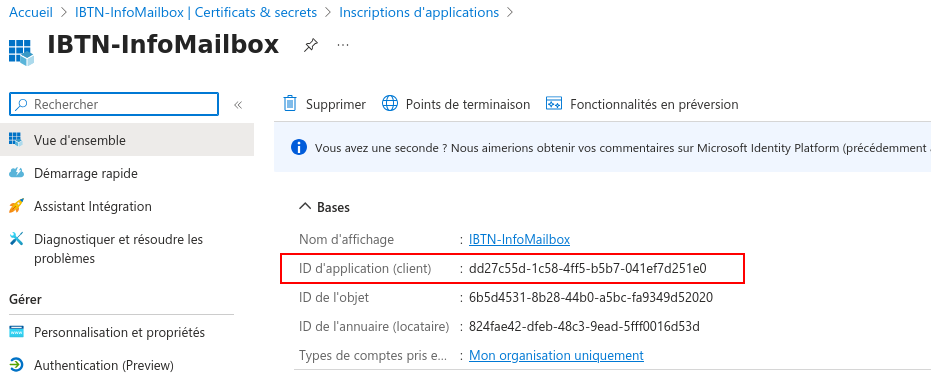
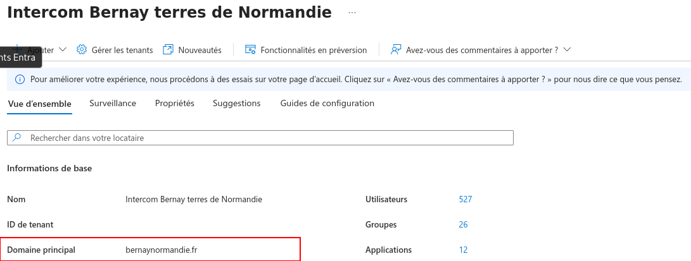
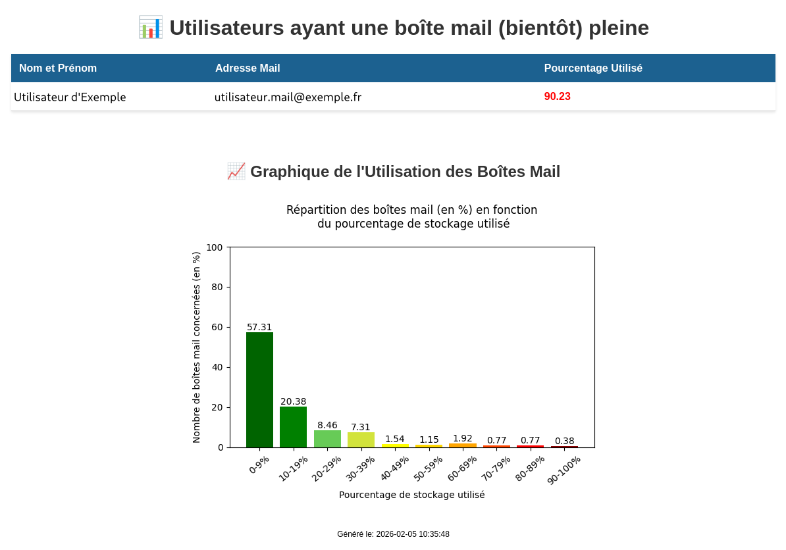
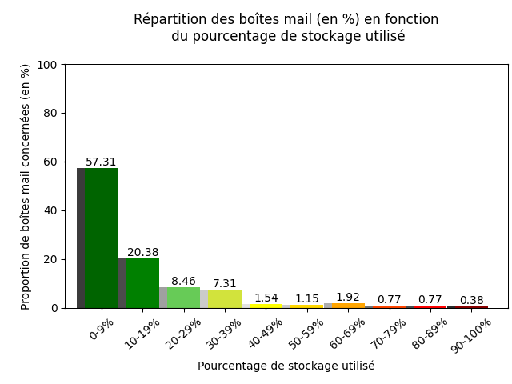

# Guide

## Préparation de l'environnement

NB : Les commandes suivantes sont à taper dans le terminal

Pour permettre une meilleure lecture de ce fichier : 
- Si vous souhaitez une application à télécharger : [Typora](https://typora.io/#feature)
	* Cliquez sur `Download` en haut de la page ;
	* Sélectionnez votre système d'exploitation ; 
	* Soit le téléchargement commence immédiatement (pour Windows notamment) ; 
	* Soit quelques consignes doivent être suivies (pour Linux par exemple) : 
		* Appuyez sur le bouton `Download Typora.deb` ; 
		* -- OU -- 
		* Tapez dans le terminal les commandes indiquées sur le site (aussi écrites ci-dessous) : 
			```sh
			# Add Typora's key
			sudo mkdir -p /etc/apt/keyrings
			curl -fsSL https://downloads.typora.io/typora.gpg | sudo tee /etc/apt/keyrings/typora.gpg > /dev/null	
			# Add Typora's repository securely
			echo "deb [signed-by=/etc/apt/keyrings/typora.gpg] https://downloads.typora.io/linux ./" | sudo tee /etc/apt/sources.list.d/typora.list
			sudo apt update
			# Install typora
			sudo apt install typora
			```

- Si vous souhaitez rester sur une version en ligne : [StackEdit](https://stackedit.io/)
	* Cliquez sur `Start Writing` en haut de la page ;
	* Cliquez sur le logo de StackEdit en haut à droite de l'écran, un menu vertical s'ouvrira ; 
	* Dans ce menu vertical, sélectionnez `Import / Export` puis `Import Markdown` ; 
	* Allez chercher dans les fichiers de l'ordinateur le fichier MD à lire.
	* **Attention** : cette version en ligne ne permet pas de visionner les images mises à disposition dans ce markdown

1. Sur Debian
	- Avant tout, ne pas oublier de taper la commande : `sudo apt update && sudo apt upgrade` ; 
	- **PHP**, installable avec la commande : `sudo apt install php php-common libapache2-mod-php php-cli` ; 
	- **Python**, installable avec la commande : `sudo apt install python3 python3-pip python3-venv pip` ;
	- **Attention** il est nécessaire de créer un environnement virtuel Python pour l'installation des dépendances essentielles :
		* **Remarque** : Il faut s'assurer que l'on se trouve dans le répertoire de travail (ici ***zabbixMailbox***) !
		* Création de l'environnement virtuel : `python3 -m venv .venv` ; 
		* Activation de l'environnement : `source .venv/bin/activate` ;
		* Puis installation des dépendances : `pip install -r requirements.txt`
			* Le `-r` est important car il permet de lire l'entièreté du fichier et d'installer toutes les dépendances nécessaires.
		* **Pour lancer le script :** `python infoMailBox.py` ;
			* Vérifier que le terminal a la structure suivante avant de taper la commande : `(.venv) Utilisateur@Appareil:~Chemin/Vers/Le/Script`
		* Pour désactiver l'environnement virtuel (en général en fin d'utilisation) : `deactivate`.

&nbsp;

2. Sur Windows
	- **PHP**, installable en suivant le lien : 
		* Installez la dernière version de PHP via ce lien : [Télécharger PHP sur Windows](https://windows.php.net/download/)
			* **Attention** : Il faut vérifier que l'on télécharge la version **x64 Thread Safe**.
		* Créez un dossier `php` à la racine de votre environnement de travail (`C:\`) puis extrayez le contenu du ZIP précédemment enregistré dedans ;
		* Configurez PHP en créant le fichier `php.ini` (copiez le fichier `php.ini-development`) comme configuration par défaut. Modifiez le fichier `php.ini` (enlevez le "**;**" pour décommenter la ligne). <br>
		Il faut également activer les extensions nécessaires à la majorité des applications : 
			```ini
			extension=curl 
			extension=gd 
			extension=mbstring 
			extension=pdo_mysql
			```
			* **Remarque** : Il est possible d'installer PHP n'importe où sur votre système, mais il faudra modifier les chemins référencés.
		* Ajoutez PHP à la variable d'environnement `PATH`. 
			* Cliquez sur le bouton `Démarrer` de Windows et tapez `environnement`, puis cliquez sur `Modifier les variables d’environnement système`.
			* Sélectionnez l'onglet `Avancé`, puis cliquez sur le bouton `Variables d'environnement`.
			* Faites défiler la liste des variables système et cliquez sur `Chemin d'accès`, puis sur le bouton `Modifier`.
			* Cliquez sur `Nouveau` et ajoutez `C:\php`.
		* **Apache ne doit pas être en cours d'exécution**, ouvrez le fichier CONF `C:\Apache24\conf\httpd.conf` avec un éditeur de texte. 
			* Ajoutez au bas du fichier pour définir PHP en tant que module Apache :
				```conf
				# PHP8 module
				PHPIniDir "C:/php"
				LoadModule php_module "C:/php/php8apache2_4.dll"
				AddType application/x-httpd-php .php
				```

	- **Python**, installable en suivant le lien : [Télécharger Python sur Windows](https://www.python.org/downloads/) :
		* Choisissez la version adaptée à Windows.
		* Téléchargez le fichier d'installation et exécutez-le.
		* Cochez la case "Ajouter Python à PATH" pour faciliter l'utilisation en ligne de commande.
		* Cliquez sur "Install Now".

	- **Attention** il est nécessaire de créer un environnement virtuel Python pour l'installation des dépendances essentielles :
		* **Remarque** : Il faut s'assurer que l'on se trouve dans le répertoire de travail (ici ***zabbixMailbox***) !
		* Création de l'environnement virtuel : `C:\Python35\python -m venv C:\Chemin\Vers\Le\.venv` ; 
		* Activation de l'environnement : `.venv\Scripts\activate` ;
		* Puis installation des dépendances : `pip install -r requirements.txt`
			* Le `-r` est important car il permet de lire l'entièreté du fichier et d'installer toutes les dépendances nécessaires.
		* **Pour lancer le script :** `C:\Chemin\Vers\Le\.venv\Scripts\python.exe infoMailbox.py` ;
		* Pour désactiver l'environnement virtuel (en général en fin d'utilisation) : `deactivate`.

&nbsp;

3. Tout ceci est automatisé via une **configuration Cron** (sur Debian) : 
	- Pour accéder à Cron : `crontab -e` dans le terminal. Cette commande va amener l'utilisateur à une page comme celle-ci :

		&nbsp; 

	- Pour valider l'automatisation, il faut descendre jusqu'en bas de la page et taper une ligne dont la structure sera : 
		* Minute **(0-59)** | Heure **(0-23)** | Jour du mois **(1-31)** | Mois **(1-12)** | Jour de la semaine **(1-7 ou mon,tue,wed...)** | (Optionnel : l'utilisateur) | **Commande à exécuter**

		* Ce qui peut donner une ligne comme : `0 8 * * 1 /usr/bin/python3 /chemin/absolu/vers/un/script.py` 
		pour une planification tous les lundis à 8h du script.py concerné.

		* Il est aussi possible de faire un enchaînement de commandes entre elles avec des : **&&**. Ce qui pourrait donner : 
		`0 8 * * 1 sudo apt update && sudo apt upgrade -y`

		* Enfin, une dernière option permet de relancer le script à chaque redémarrage de la machine : **@reboot**. Cette option va venir remplacer toutes les valeurs concernant la date, pour donner une ligne du style suivant : 
		`@reboot sudo apt update && sudo apt upgrade -y`

		* Ce ne sont pas les seules options possibles avec crontab (*@hourly, @midnight, @annually*), mais ce seront les plus importantes dans notre cas.

		* Dans notre cas, on pourrait écrire la ligne suivante : `0 8 * * 1 cd /home/informatique/Bureau/zabbixMailbox && .venv/bin/python infoMailbox.py`

		* **Attention** : pour que cron s'exécute correctement, il est nécessaire de laisser une ligne vide à la fin du fichier.

&nbsp;

4. Ou **Planificateur de tâches** (sur Windows) :

	- Etape 1 : Accéder au Planificateur de tâches
		* Appuyez sur les touches `Windows + R` pour ouvrir la boîte de dialogue Exécuter (situé en bas à gauche de l'écran).
    	* Tapez `taskschd.msc` et appuyez sur `Entrée`.
    	* La fenêtre du Planificateur de tâches s’ouvrira en affichant les tâches déjà planifiées.

	- Etape 2 : Créer une nouvelle tâche
		* Création rapide avec une tâche de base :
			* Dans le volet de droite, cliquez sur `Créer une tâche de base` ;
    		* Donnez un nom et une description à la tâche et cliquez sur `Suivant` ;
    		* Sélectionnez la fréquence de déclenchement de la tâche (*quotidien, hebdomadaire, évènement spécifique, etc.*) ;
    		* Définissez la date, l’heure et, le cas échéant, la fréquence de répétition de la tâche puis cliquez sur `Suivant` ;
    		* Choisissez l’action à exécuter : `Lancer un programme` ;
        	* Cliquez sur `Parcourir` et sélectionnez le programme ou le script à exécuter ;
        	* Ajoutez des arguments si besoins ;
    		* Cliquez sur `Terminer` pour valider.

&nbsp;

## Explication des fichiers

### I. infoMailbox.py

1. Import des modules essentiels (lignes 1-4) :
	- `requests` : Il s'agit d'un module qui permet de réaliser des **requêtes HTTP** en Python.

	- `os` : Ce module fournit une façon portable d'utiliser les fonctionnalités dépendantes du système d'exploitation. Si l'on souhaite lire ou écrire un fichier avec `open()` ou encore manipuler les chemins de fichiers avec `os.path`.

	- `logging` : Ce module définit les fonctions et les classes qui mettent en œuvre un système flexible d’enregistrement des événements pour les applications et les bibliothèques.

	- `json` : Ce module standard permet de manipuler facilement des fichiers JSON, qu’il s’agisse de les lire, de les modifier, ou de les créer. <br>
	Le JSON (JavaScript Object Notation) est un format de données très populaire utilisé pour représenter des informations de manière simple et lisible.

2. Les variables importantes (lignes 6-15) : 
	- `clientId` : l'ID de l'application qui permet au programme d'accéder aux informations des boîtes mail des utilisateurs. Cette ID est obtenable ici : 
	
		&nbsp;  
	
	- `clientSecret` : le secret n'apparaît en entier que lors de la création de l'application et permet, couplé au client, de lire les informations des boîtes des utilisateurs. Il sera visible ici : 
	
		&nbsp; 
	
		Remarque : Dans Microsoft Entra, ce programme est connu sous l'application **IBTN-InfoMailbox**
	
	- `tenantName` : Il s'agit du nom de domaine lié à Microsoft Entra, trouvable ici : 
	
		&nbsp; 

	- `jsonAffiche` : Cette variable va contenir les noms, prénoms, mails et pourcentages de boîte mail utilisé si ceux-ci sont supérieurs à 90%.

	- `loginUrl` : Il s'agit du lien qui permet au programme de se connecter à Microsoft ; 

	- `graphUrl` : Il s'agit du lien générique vers Microsoft Graph ;

	- `userUrl` : Il s'agit du lien complet permettant la lecture des utilisateurs. ;

3. Le programme (lignes 17-165)
	- **Système de logs** (lignes 17-26) : Les logs du programme seront enregistrés dans le dossier ***fichierImportant*** sous le nom `mailbox.log` ;

	- **Fonction de connexion** (lignes 29-50) : 
		* Cette fonction contient un docstring afin d'expliquer l'objectif de son exécution ainsi que les différents paramètres nécessaires à son exécution **(lignes 29-35)** ;

		* On va définir le lien complet de connexion ainsi que les informations nécessaires pour récupérer le token de connexion **(lignes 37-44)** ;

		* Si la demande de token a échoué, on écrit une erreur dans le fichier de log. Puis on renvoie la réponse de la requête de connexion en format JSON **(lignes 46-50)**.

	- **Fonction de récupération des utilisateurs** (lignes 53-85) : 
		* Cette fonction contient un docstring afin d'expliquer l'objectif de son exécution ainsi que les différents paramètres nécessaires à son exécution **(lignes 53-57)** ;

		* Tant que le lien Microsoft Graph pour accéder aux utilisateurs est valide, on envoie une requête pour récupérer les informations basiques des utilisateurs **(lignes 60-64)** ;

		* Pour chaque utilisateur, on récupère les informations basiques (nom d'utilisateur, mail et id) et on les formate pour faire une nouvelle variable JSON **(lignes 66-73)** ;

		* On filtre les utilisateurs pour ne garder que ceux qui font partis de l'organisation **(lignes 75-78)** ; 

		* On passe ensuite à l'utilisateur suivant. Une fois l'exécution terminée, on renvoie le JSON avec les informations des utilisateurs **(lignes 80-83)**.

	- **Fonction de récupération des boîtes mail** (lignes 86-99) : 
		* Cette fonction contient un docstring afin d'expliquer l'objectif de son exécution ainsi que les différents paramètres nécessaires à son exécution **(lignes 86-90)** ;

		* Pour chaque utilisateur, on récupère les informations de sa boîte mail et, plus précisément, les informations de stockage. Puis, on calcule le pourcentage de stockage utilisé grâce à une autre fonction **(lignes 92-99)**.

	- **Fonction de conversion et de calcul de pourcentage** (lignes 102-131) : 
		* Cette fonction contient un docstring afin d'expliquer l'objectif de son exécution ainsi que les différents paramètres nécessaires à son exécution **(lignes 102-106)** ;

		* On définit le stockage maximal (49,5 Go pour chacun) et initialisation du stockage et pourcentage de chacun (début à 0) **(lignes 108-111)** ;

		* Pour chaque dossier de la boîte mail, on récupère la valeur de sa taille (en byte), on la convertit en octet (1 byte = 1 octet) (donc pas de conversion) et on calcule le pourcentage total **(lignes 113-120)** ;

		* Enfin, on ajoute dans la variable JSON qui nous permettra d'afficher un tableau et un graphique les données que l'on souhaite garder (nom et prénom de l'utilisateur, mail et pourcentage de stockage utilisé) et on ignore les boîtes mail vides **(lignes 122-131)**.

	- **Fonction de classement des utilisateurs** (lignes 133-137) : Cette fonction va prendre un dictionnaire en paramètre et va renvoyer la valeur, en pourcentage, du stockage utilisé. Cette fonction, alliée à la méthode `sorted()` de Python permet de trier des dictionnaires en fonction de la valeur du pourcentage seul 

	- **Lancement du script principal** (lignes 139-162) : 
		* La variable `oauth` va appeler la fonction `getAccessToken` en y passant les paramètres demandés. Variable à partir de laquelle on va récupérer les valeurs `access_token` et `token_type` qui sont nécessaires pour lire les utilisateurs et les boîtes mail et doivent se trouver dans l'entête de la requête HTTP **(lignes 140-143)** ;

		* On définit l'en-tête pour réaliser les requêtes sur l'API Graph **(lignes 145-149)** ;

		* On exécute successivement les fonctions créées ci-dessus et on ajoute une information dans les logs pour s'assurer de la bonne exécution du programme **(lignes 151-155)** ;

		* On effectue un classement décroissant des utilisateurs grâce à la méthode `sorted()` de Python **(lignes 157)** ; 

		* On crée un fichier JSON contenant les données des utilisateurs et on ajoute un message aux logs pour signaler la bonne exécution **(lignes 159-162)**.

	- **Gestion des erreurs** (lignes 164-165) : En cas d'erreur lors de l'exécution du script, on ajoute au fichier de log une erreur générique avec le contenu de l'erreur. 

### II. data.php

1. **En-tête de la page Web** (lignes 1-65) : Cette partie va notamment contenir le CSS (style de la page) pour un résultat plus esthétique ; 

2. **Mise en page des données sous forme de tableau** (lignes 67-91) : Cette partie va récupérer les données du fichier ***MailboxInfo.json*** si l'utilisateur utilise plus de 90% de sa boîte mail et les mettre en forme dans un tableau permettant une meilleur lisibilité des informations des utilisateurs. 

3. **Affichage d'un graphique de représentation** (lignes 92-100) : Cette partie se consacre principalement à l'affichage d'une image d'un graphique de représentation du taux d'utilisation des boîtes mail au sein de la structure.

### III. webServer.py

1. **Import des modules essentiels** (lignes 1-3) : 
	- `Flask`, `Response` & `send_from_directory`: Ces 3 classes/fonctions appartenant au module flask de Python qui est un petit framework web léger et qui fournit des outils et des fonctionnalités utiles pour faciliter la création d’applications web en Python. 
		* **Flask** : Cet objet est le centre de gravité de l'application web ;
		* **Response** : Cet objet est utilisé par défaut par Flask, il est notamment utile pour l'utilisation de HTML.
		* **send_from_directory** : Cette fonction permet l'affichage de fichiers statiques (images notamment) depuis un dossier spécifié.
	
	- `subprocess` : Il s'agit d'un outil qui permet d'exécuter d'autres programmes ou commandes à partir d'un code Python. Il peut être utilisé pour ouvrir de nouveaux programmes, leur envoyer des données et obtenir des résultats en retour.

	- `os` : Ce module fournit une façon portable d'utiliser les fonctionnalités dépendantes du système d'exploitation. Si l'on souhaite lire ou écrire un fichier avec `open()` ou encore manipuler les chemins de fichiers avec `os.path`.

	- `logging` : Ce module définit les fonctions et les classes qui mettent en œuvre un système flexible d’enregistrement des événements pour les applications et les bibliothèques.

2. **Création de l'application web** (lignes 5-7) : On initialise un objet Flask qui va prendre pour intitulé le nom du fichier et on récupère le chemin qui mène aux fichiers.

3. **Système de logs** (lignes 10-19) : En cas d'erreur lors de l'exécution du programme, des logs seront enregistrés dans le dossier ***fichierImportant*** sous le nom `mailbox.log` ; 

4. **Récupération des données de l'affichage** (lignes 21-48) : 
	- On va essayer d'exécuter le fichier ***data.php*** et récupérer le résultat dans la variable `result` **(lignes 24-32)** ; 

	- Si l'exécution du PHP retourne un code 0 (succès) alors on affiche le résultat de l'exécution. Sinon, on renvoie un message d'erreur sur l'application web **(lignes 34-38)** ; 

	- On ajoute plusieurs exceptions pour pouvoir régler au plus rapidement possible les erreurs **(lignes 40-48)** : 
		* `subprocess.TimeoutExpired` : Si l'exécution du script PHP prend au moins 10 secondes, on renvoie une erreur et on ajoute un message d'erreur dans le fichier de log ; 
		* `FileNotFoundError` : Si le fichier PHP est introuvable (effacé par erreur ou stocké dans un autre répertoire par exemple), on renvoie une erreur différente et on ajoute un message d'erreur dans le fichier de log ; 
		* `Exception` : S'il y a une autre erreur (non définie précédemment), on renvoie un message d'erreur générique et on ajoute un message d'erreur dans le fichier de log.

	- On crée une fonction qui permet d'afficher sur le serveur web des fichiers statiques (comme l'image d'un graphique) **(lignes 50-52)** ;

	- On lance l'application web sur l'adresse de la machine (ici 192.168.50.247) et au port 5050 **(lignes 54-55)**.

5. Afin de voir le résultat de l'exécution de ce script il faut se rendre dans son navigateur et taper dans la barre de recherche `https://ibtn-pcf-069.ibtn.local:5050/` ou `https://192.168.50.247:5050/`. Cependant, une page d'avertissement apparaîtra sur l'écran, il faudra cliquer sur le bouton "Avancer" puis sur "Accepter le risque". Une fois cela fait, la page suivante devrait s'afficher à l'écran : 

	&nbsp; 

### IV. mailGraph.py

1. **Import des modules essentiels** (lignes 1-6) : 
	- `matplotlib.pyplot` : Cette bibliothèque permet de générer des graphiques depuis Python ; 

	- `json` : Ce module standard permet de manipuler facilement des fichiers JSON, qu’il s’agisse de les lire, de les modifier, ou de les créer. <br>
	Le JSON (JavaScript Object Notation) est un format de données très populaire utilisé pour représenter des informations de manière simple et lisible ; 

	- `pylab` : Cette librairie permet d’utiliser de manière aisée les bibliothèques numpy (manipulation de valeurs mathématiques) et matplotlib (création de graphique) pour de la programmation scientifique avec Python ;

	- `Image` : Cette classe fait partie de la librairie Python `Pillow` qui succède le projet PIL (Python Imaging Library). Elle est conçue de manière à offrir un accès rapide aux données contenues dans une image ;

	- `os` : Ce module fournit une façon portable d'utiliser les fonctionnalités dépendantes du système d'exploitation. Si l'on souhaite lire ou écrire un fichier avec `open()` ou encore manipuler les chemins de fichiers avec `os.path` ;

	- `logging` : Ce module définit les fonctions et les classes qui mettent en œuvre un système flexible d’enregistrement des événements pour les applications et les bibliothèques.

2. **Le programme** (lignes 8-140) : 
	- On va initialiser des valeurs par défaut : `labels` pour chacunes des barres de valeurs que l'on aura et `values` une liste composée de 0 car on a pas encore traité nos données **(lignes 8-10)** ; 

	- On va récupérer les données des utilisateurs contenues dans le fichier JSON ***MailboxInfo.json* (lignes 11-13)** ;

	- **Système de logs** (lignes 15-24) : Les logs du programme seront enregistrés dans le dossier ***fichierImportant*** sous le nom `mailbox.log` ;

	- **Fonction de conversion d'image** (lignes 26-58) : 
		* Cette fonction contient un docstring afin d'expliquer l'objectif de son exécution ainsi que les différents paramètres nécessaires à son exécution **(lignes 27-38)** ;

		* On commence par ouvrir l'image que l'on souhaite modifier pour en récupérer ses données **(lignes 39-41)** ; 

		* Pour chaque tuple (ou pixel) **(lignes 43-50)**: *Format (R, G, B, A)*
			* Si les bits des couleurs sont exactement égaux les uns aux autres (donc une nuance de blanc, gris, noir), alors, on rend le pixel transparent ; 
			* Sinon, le pixel garde la même couleur ;
				* Mais si le paramètre `gray` est égal à `True`, la couleur du pixel sera changée en un gris clair.
			* **Remarque** : à la ligne 45 se trouve l'expression `and eval(**moreIf**)`. La méthode `eval()` permet d'évaluer des expressions arbitraires (ici le paramètre ***moreIf*** de la fonction) à partir d'une entrée basée sur des chaînes de caractères ou un code compilé. Cette fonction peut être pratique lorsque l'on essaye d'évaluer dynamiquement les expressions Python. <br>
			Cette expression permet de rajouter une condition à notre structure, en transformant une chaîne de caractère en code compréhensible par Python *à condition que la chaîne a une structure convenable pour effectuer le tri*. <br>
			Par défaut cette expression est `1==1` qui est une condition toujours vraie, n'enclavant donc pas l'exécution du script.

		* Une fois le traitement complet de l'image fait, on met à jour les pixels de l'image, on la reconvertit en une image RGBA, puis on l'enregistre avec le nom fourni en paramètre de la fonction **(lignes 51-54)** ; 

		* Enfin, si le paramètre `gray` est True (Vrai), on récupère l'image précédemment créée et on la convertit et enregistre en une image monochrome (nuances de gris). Ce qui permet de récupérer l'image au fond transparent pour lui donner un fond blanc, cette image servira de fond sur lequel on superposera le nouveau graphique **(lignes 56-58)**
	
	- **Fonction de traitement des données** (lignes 61-91) : 
		* Cette fonction contient un docstring afin d'expliquer l'objectif de son exécution ainsi que les différents paramètres nécessaires à son exécution **(lignes 62-65)** ;

		* On va parcourir nos données JSON (fournies en paramètre de la fonction) et à chaque pourcentage on incrémente la valeur qui lui correspond **(lignes 66-87)**: 
			* Si le pourcentage se trouve entre 0 et 9,99%, on incrémente la première valeur de la liste `values` ; 
			* Si le pourcentage se trouve entre 10 et 19,99%, on incrémente la deuxième valeur de la liste ; 
			* . . . (il s'agit de la même logique pour toutes les valeurs)
			* Si le pourcentage se trouve entre 80 et 89,99%, on incrémente la neuvième valeur de la liste ; 
			* Sinon, on incrémente la dernière valeur de la liste (le pourcentage est supérieur à 90%).

		* On va ensuite convertir les valeurs de la liste `values` en pourcentage pour éviter les cas dans lesquels on obtient des chiffres avec une différence faramineuse **(lignes 89-91)** ; 

	- **Fonction de création de graphique à barre** (lignes 93-123) : 
		* Cette fonction contient un docstring afin d'expliquer l'objectif de son exécution ainsi que les différents paramètres nécessaires à son exécution **(lignes 94-103)** ;

		* On va créer un graphique vide puis on va y ajouter nos valeurs et nos labels. On va définir un style et une valeur pour chaque barre de notre graphique (pour aider à la visualisation). Ensuite, on ajoute les titres des axes et du graphique **(lignes 104-113)** ; 

		* On définit la taille de l'axe x et on y ajoute ses labels **(lignes 115-117)** ; 

		* On ajuste automatiquement la taille de la fenêtre pour éviter que le graphique soit rogné, on enregistre le graphique sous forme d'image dans le dossier `fichierImportant` sous le nom ***graphique.png*** et on ajoute une information dans les logs **(lignes 119-123)**.

		* Image d'exemple du graphique qui sera enregistré : 

			&nbsp; 

	- **Lancement du script principal** (lignes 125-137) :
		* On va traiter les données, vérifier si un graphique n'existe pas déjà (s'il n'en existe pas, on en crée un), créer les graphiques et modifier les images grâce aux fonctions définies ci-dessus **(lignes 126-131)** ; 

		* On va créer l'image qui sera affichée sur Zabbix en superposant 2 images créées précédemment. Puis, on va l'enregistrer dans le dossier `fichierImportant` sous le nom ***graphDiffere.png* (lignes 132-136)** ; 

		* Enfin, on ajoute un message dans le fichier de logs indiquant le bon déroulement du script **(ligne 137)**. 

	- **Gestion des erreurs** (lignes 139-140) : En cas d'erreur lors de l'exécution du script, on ajoute au fichier de log une erreur générique avec le contenu de l'erreur. 

### V. requirements.txt

1. Ce fichier contient toutes les dépendances python dont le programme (.py) a besoin afin d'être correctement exécuté.

### VI. fichierImportant

#### A. certificat.pem et clePrivee.pem

1. Afin de pouvoir naviguer avec le protocole HTTPS et non HTTP, ces 2 fichiers contiennent un certificat d'une autorité de certification et la clé privée qui permet le chiffrement asymétrique des données. 

#### B. mailbox.log

1. Ce fichier log va contenir les informations importantes générées par le script ***infoMailbox.py***.

#### C. MailboxInfo.json

1. Ce fichier JSON va contenir les informations des utilisateurs dont le taux d'utilisation de la boîte mail est supérieur à 90%. Ces informations étant le nom et le prénom, l'adresse mail et le pourcentage d'utilisation en question.

#### D. graphique.png, grayScale.png et graphDiffere.png

1. Ces 3 images vont être créées et/ou modifiées lors de l'exécution du script ***mailGraph.py***. 